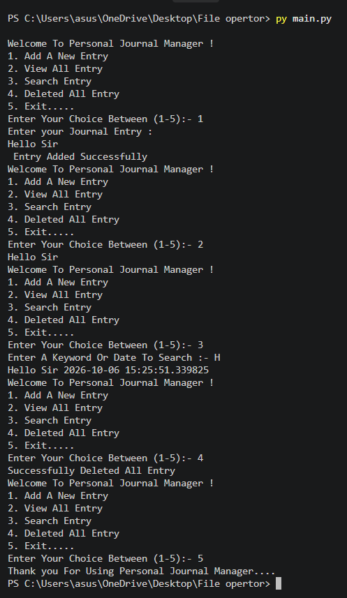

# Employee Management System 

## A Simple Python-Based Personal Journal Management System

# Features

- Add a new journal entry
- View all journal entries
- Search entries using a keyword or date
- Delete all journal entries
- Display date and time of entries
- Simple menu-driven interface


---

# Technologies Used

- **Programming Language:** Python

- **Editor:** VS Code 

---

# Concepts Used


- Variables and Data Types
- Input and Output
- Conditional Statements
- While Loop
- Functions
- File Handling
- String Searching
- Date and Time

---

# How To Use

1. Run the Python program.
2. Select an option from the menu.
3. Enter your journal entry when required.
4. View, search, or delete entries as needed.
5. Select option 5 to exit.

```text
1. Add A New Entry
2. View All Entry
3. Search Entry
4. Deleted All Entry
5. Exit.....

---

# Installation

### Step 1: Install Python

Download and install Python from:

```
https://www.python.org/
```

### Step 2: Clone or Download Project

Download the project files into your system.

### Step 3: Run Program

Open terminal:

```
python main.py
```

---

# Example Output

```
Welcome To Personal Journal Manager !
1. Add A New Entry
2. View All Entry
3. Search Entry 
4. Deleted All Entry 
5. Exit.....
Enter Your Choice Between (1-5):- 1
Enter your Journal Entry : 
Hello sir
 Entry Added Successfully


Welcome To Personal Journal Manager !
1. Add A New Entry
2. View All Entry
3. Search Entry 
4. Deleted All Entry 
5. Exit.....
Enter Your Choice Between (1-5):- 2
Hello sir


Welcome To Personal Journal Manager !
1. Add A New Entry
2. View All Entry
3. Search Entry 
4. Deleted All Entry 
5. Exit.....
Enter Your Choice Between (1-5):- 3
Enter A Keyword Or Date To Search :- H
Hello sir 2026-10-06 15:40:54.357204


Welcome To Personal Journal Manager !
1. Add A New Entry
2. View All Entry
3. Search Entry 
4. Deleted All Entry 
5. Exit.....
Enter Your Choice Between (1-5):- 4
Successfully Deleted All Entry 


Welcome To Personal Journal Manager !
1. Add A New Entry
2. View All Entry
3. Search Entry 
4. Deleted All Entry 
5. Exit.....
Enter Your Choice Between (1-5):- 5
Thank you For Using Personal Journal Manager....

```


### Output 



---

# Project Structure

```

│
├── main.py
│
├── output.png
│
└── README.md
│
├── data.txt
    
```

---

# Author

**Dev Thakkar**